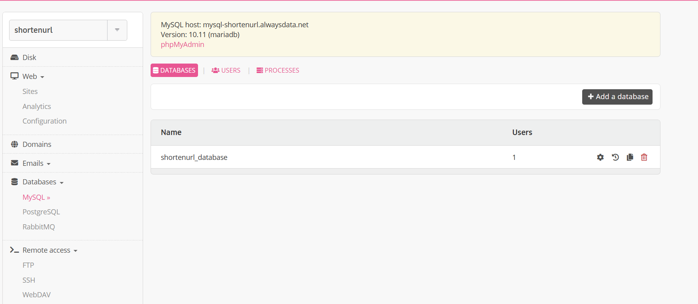
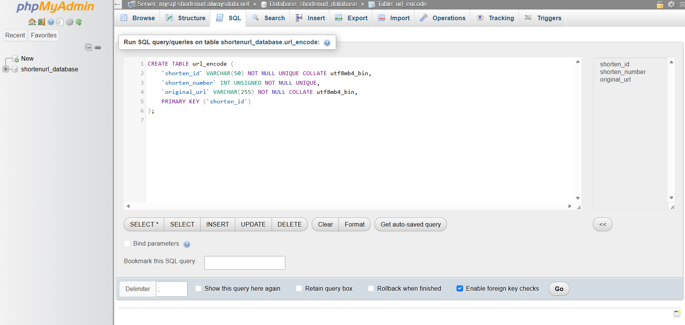
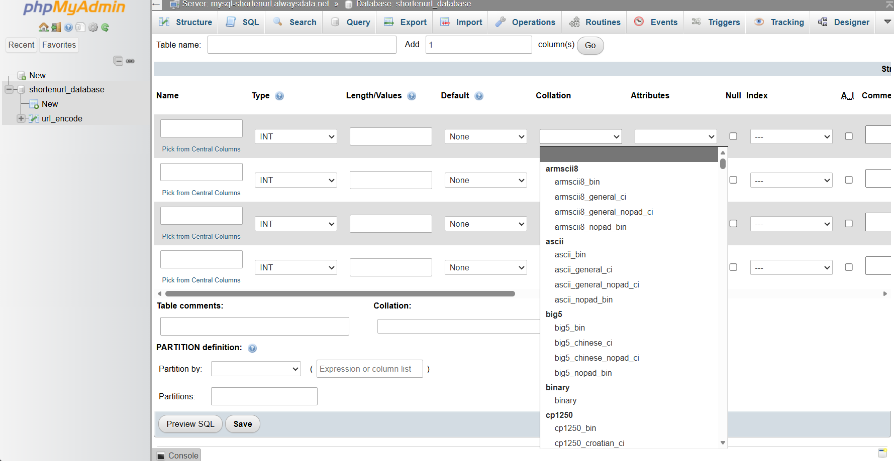
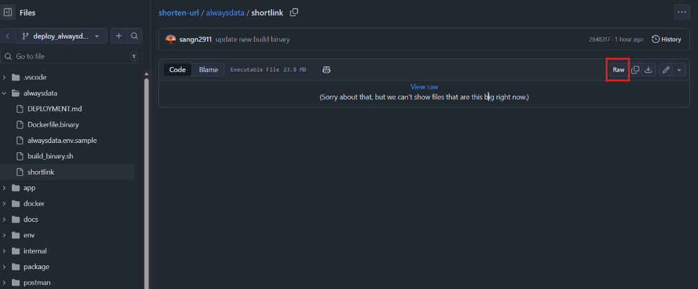
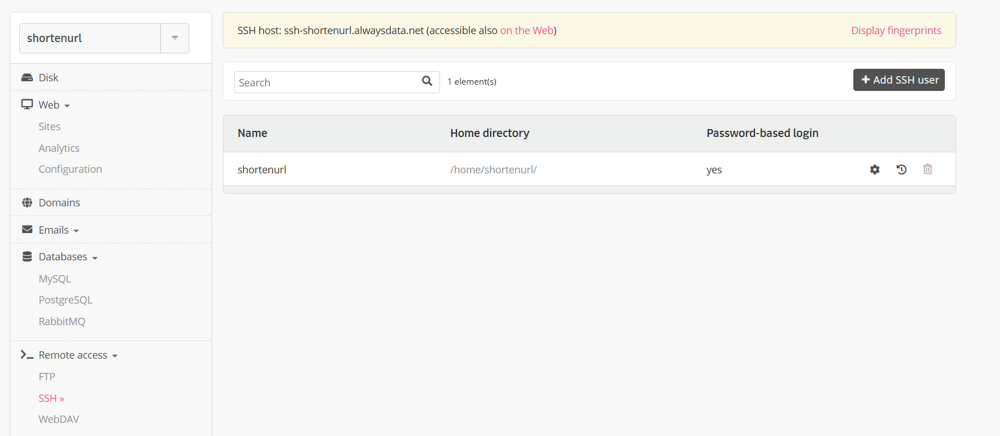
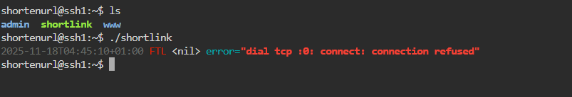
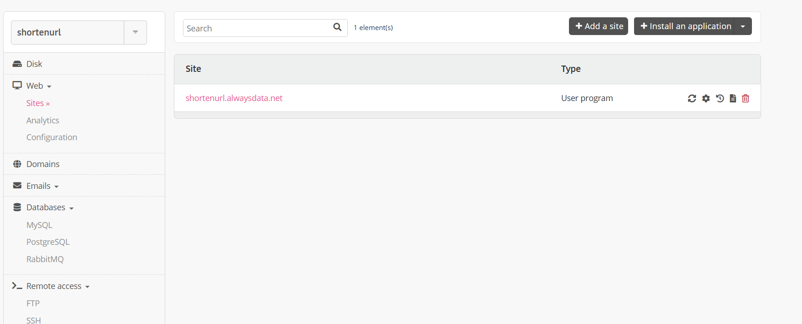
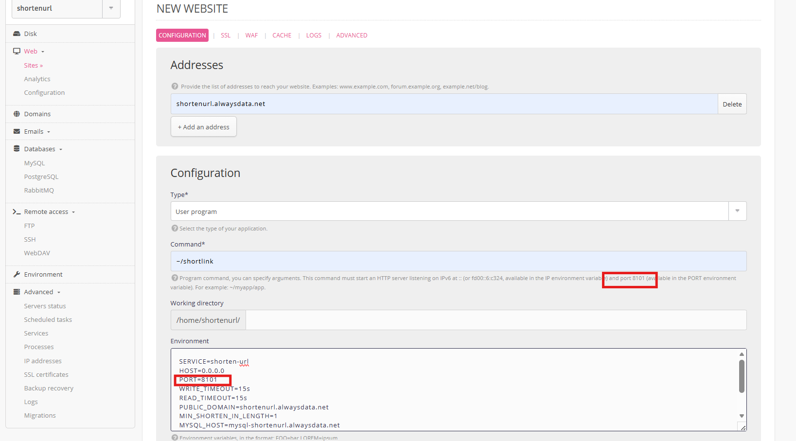
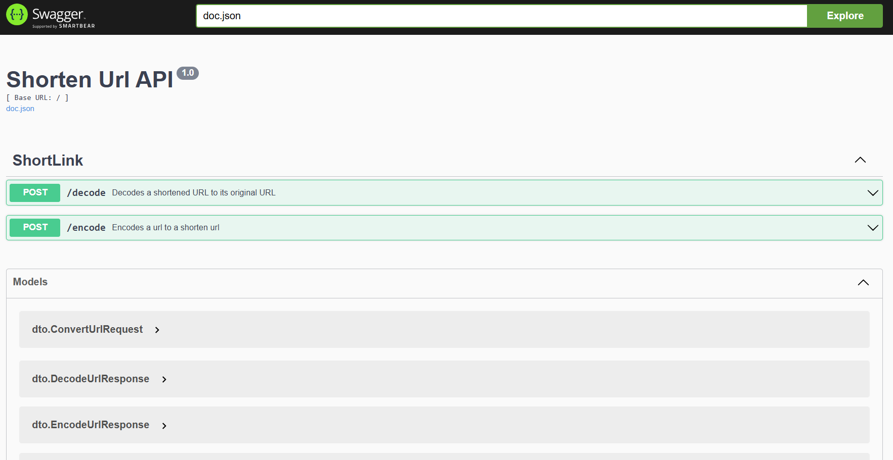

# Deploys on alwaysdata

## Prerequisites
- Account for [alwaysdata](https://admin.alwaysdata.com/)
- Go binary for application [Shortlink](./shortlink) in github

## Deployment
### MySQL
- Go to [MySQL alwaysdata](https://admin.alwaysdata.com/database/?type=mysql)  
    - 
- In "DATABASES" tab, add a new database named "shortenurl_database" (the name will be used in application configuration)  
- In "USERS" tab, modify the password of the existing user (in this case, we modify user "441172")
- Go to [phpMyAdmin](https://phpmyadmin.alwaysdata.com/), login with user "441172"
- Select shortenurl_database, and go to SQL tab
    - 
- Copy and execute script [create_table.sql](./create_table.sql)
    - Notes: Be careful about the COLLATE may not be supported, we can create new table by using UI, and check the list of collations to choose the suitable one
        - 
- Verify setup by query "SELECT * FROM url_encode;"

### Application
*Note: For free plan of alwaysdata, docker is not supported. Therefore, to deploy a Go application, we need to build a binary file, and move to alwaysdata storage.  
#### 1. Build binary
- Start at root of projects
- Execute ./alwaysdata/build_binary.sh to build binary file named "shortlink"
- Push file binary to github branch "deploy_alwaysdata" (this will be downloaded into alwaysdata storage)
- On github websites, find binary file "shortlink" in branch "deploy_alwaysdata"
- Select the binary file and copy the link address (**binary url**) from the "Raw" button
    - 

#### 2. Download binary into alwaysdata storage
*Note: "shortenurl" is the name of account to use service of alwaysdata. Therefore, the information (contains "shortenurl") here can be different for other accounts. 
- Go to tab [SSH alwaysdata](https://admin.alwaysdata.com/ssh/)
    - 
- Modify the password of the existing user (in this case, we modify user "shortenurl")
- Go to [SSH websites](https://ssh-shortenurl.alwaysdata.net/), and login with the user above to enter the terminal
- Execute command "wget **binary url**" (The link get from **Build binary**) to download binary "shortlink". Use command "ls" to verify this step
- Execute command "chmod +x ./shortlink" to allow execute binary file
    - 

#### 3. Start Go application in alwaysdata
*Note: For free plan of alwaysdata, we can only use the address "shortenurl.alwaysdata.net" (shortenurl is the name of account)
- Go to [Sites alwaysdata](https://admin.alwaysdata.com/site/), and choose "Add a site"
    - 
- Fill the information:
    - Addresses: we use "shortenurl.alwaysdata.net" only
    - Configuration:
        - Type: User program
        - Command: "~/shortlink" (as binary "shortlink" in home directory)
        - Working directory: empty
        - Environment: fill and modify the information from [alwaysdata.env.sample](./alwaysdata.env.sample) (*Note: for PORT variable, we use the port in the description below Command input box)
    - 
- Submit
- Verify application working properly at "https://shortenurl.alwaysdata.net/swagger/index.html"
    - 
